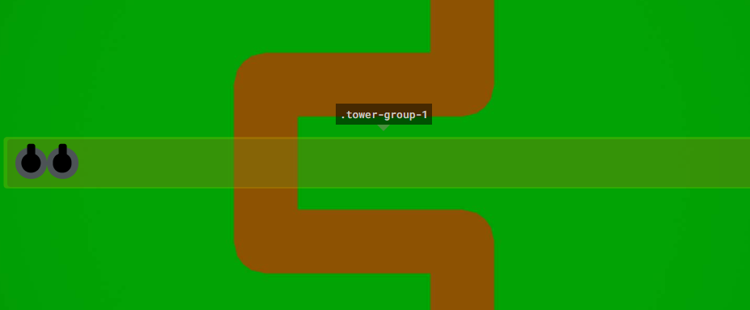

# Flexbox Defense #
Flexbox Defense é um jogo no estilo tower defense, onde é usado CSS para a movimentações das peças. Criando uma maneira para treinar suas habilidades no CSS utilizando o Flexbox!

### Game: [Flexbox Defense - Game](http://www.flexboxdefense.com/) ###

### Levels Answers ###
* [Level 1](levels/1.css)
* [Level 2](levels/2.css)
* [Level 3](levels/3.css)
* [Level 4](levels/4.css)
* [Level 5](levels/5.css)
* [Level 6](levels/6.css)
* [Level 7](levels/7.css)
* [Level 8](levels/8.css)
* [Level 9](levels/9.css)
* [Level 10](levels/10.css)
* [Level 11](levels/11.css)
